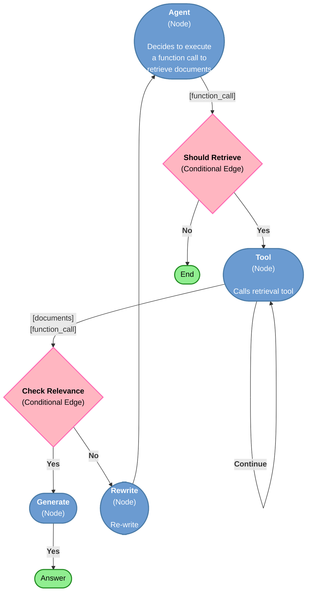

```mermaid
graph TD
    Agent(["<b>Agent</b><br/>(Node)<br/><br/>Decides to execute<br/>a function call to<br/>retrieve documents"])
    ShouldRetrieve{"<b>Should Retrieve</b><br/>(Conditional Edge)"}
    Tool(["<b>Tool</b><br/>(Node)<br/><br/>Calls retrieval tool"])
    CheckRelevance{"<b>Check Relevance</b><br/>(Conditional Edge)"}
    Generate(["<b>Generate</b><br/>(Node)"])
    Answer([Answer])
    Rewrite(["<b>Rewrite</b><br/>(Node)<br/><br/>Re-write"])
    End([End])

    Agent -->|"[function_call]"| ShouldRetrieve
    ShouldRetrieve -->|"<b>Yes</b>"| Tool
    ShouldRetrieve -->|"<b>No</b>"| End
    Tool -->|"<b>Continue</b>"| Tool
    Tool -->|"[documents]<br/>[function_call]"| CheckRelevance
    CheckRelevance -->|"<b>Yes</b>"| Generate
    Generate -->|"<b>Yes</b>"| Answer
    CheckRelevance -->|"<b>No</b>"| Rewrite
    Rewrite --> Agent

    classDef nodeStyle fill:#6B9BD1,stroke:#4A7BA7,stroke-width:2px,color:#fff
    classDef decisionStyle fill:#FFB6C1,stroke:#FF69B4,stroke-width:2px,color:#000
    classDef endStyle fill:#90EE90,stroke:#228B22,stroke-width:2px,color:#000

    class Agent,Tool,Generate,Rewrite nodeStyle
    class ShouldRetrieve,CheckRelevance decisionStyle
    class Answer,End endStyle
```
